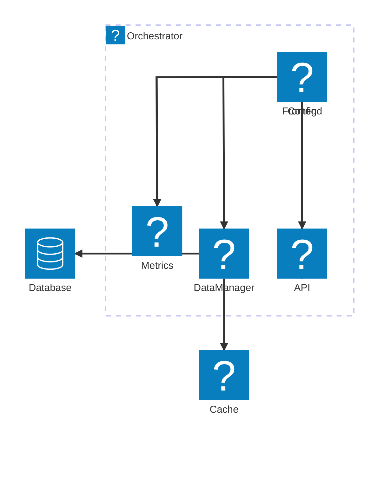

```mermaid
architecture-beta
    service db(database)[Database]
    service cache(redis)[Cache]
    service front(frontend)[Frontend]

    group orchestrator(orchestrator)[Orchestrator]
    service api(api)[API] in orchestrator
    service datamanager(datamanager)[DataManager] in orchestrator
    service config(config)[Config] in orchestrator
    service metrics(metrics)[Metrics] in orchestrator
    junction junctionCenter

    config:B --> T:api
    config:L --> T:datamanager
    config:R --> T:metrics
    datamanager:B --> T:cache
    datamanager:L --> R:db
    api:B -- T:front
    front:R -- B:metrics
```