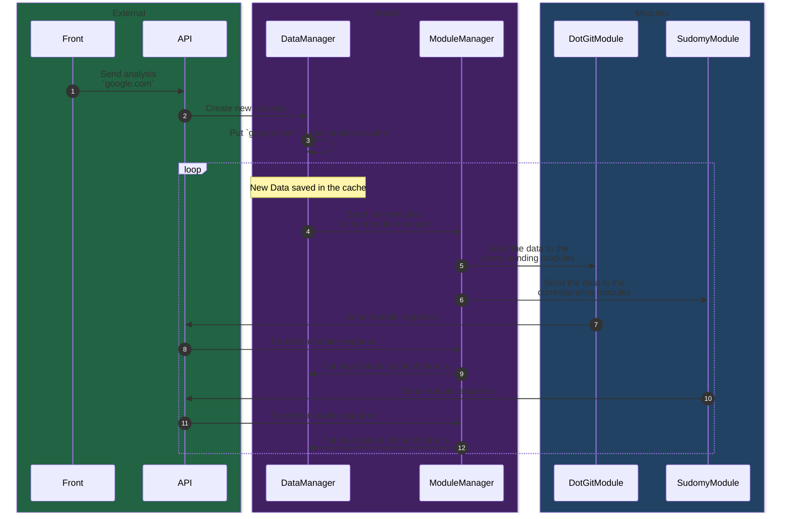

```mermaid
sequenceDiagram
    autonumber
    box rgb(33,99,66) External
        participant Front
        participant API
    end
    box rgb(66,33,99) Interal
        participant DataManager
        participant ModuleManager
    end
    box rgb(33,66,99) Modules
        participant DotGitModule
        participant SudomyModule
    end
    Front->>API: Send analysis<br/>`google.com`
    API->>DataManager: Create new analysis
    DataManager->>DataManager: Put `google.com` in new analysis cache

    loop
        Note over DataManager: New Data saved in the cache
        DataManager->>ModuleManager: Send the new data<br/>to the module manager

        ModuleManager->>DotGitModule: Send the data to the<br/>corresponding modules
        ModuleManager->>SudomyModule: Send the data to the<br/>corresponding modules

        DotGitModule->>API: Send module response
        API->>ModuleManager: Transfert module response
        ModuleManager->>DataManager: Put new data in cache if there is

        SudomyModule->>API: Send module response
        API->>ModuleManager: Transfert module response
        ModuleManager->>DataManager: Put new data in cache if there is
    end
```